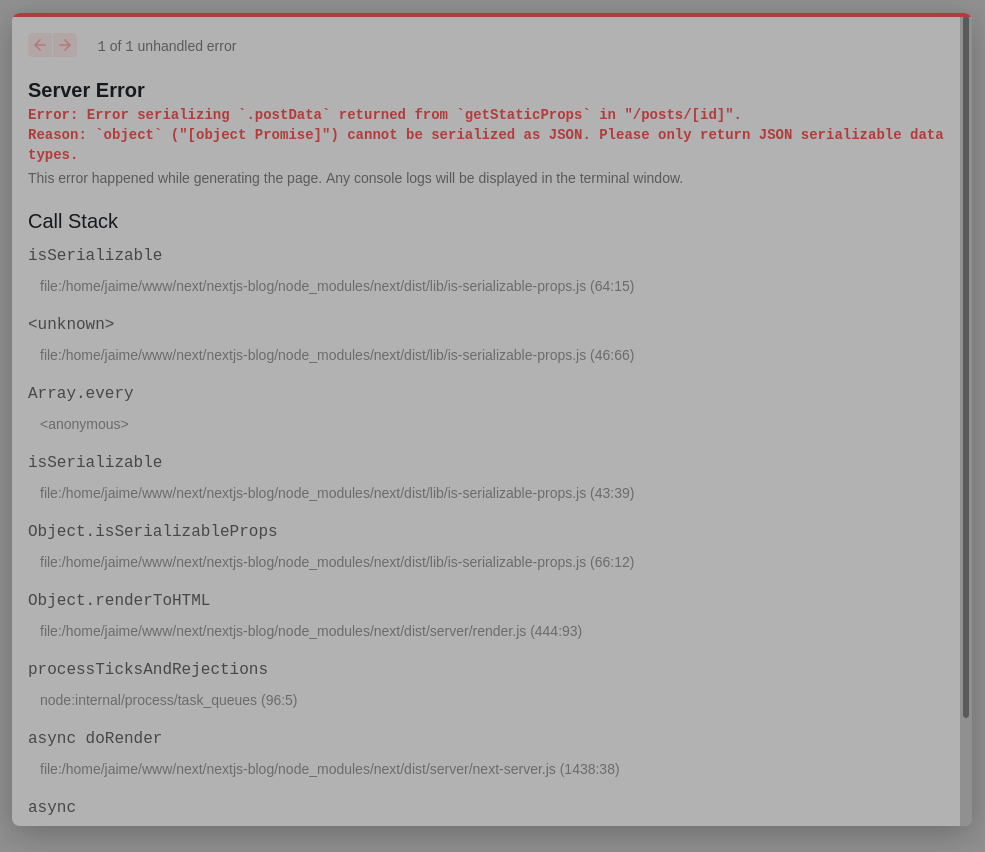

Tue Dec 14 2021 11:36:56

Am following this little tutorial and ended with this section:

> https://nextjs.org/learn/basics/dynamic-routes/render-markdown

I followed the guide 100% and even copied their code from the provided repo in another section, but still get this error.

Says the error is this file `./pages/posts/[id].js` but like I said, I copied the code exactly!

Any help is appreciated :) 

